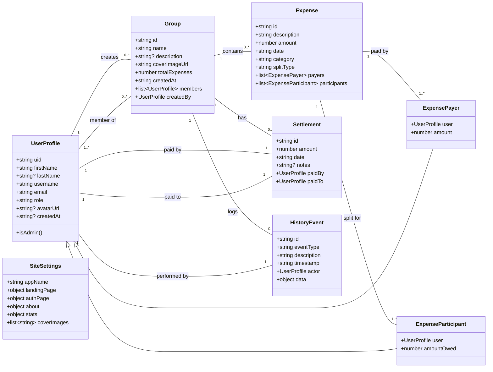

# SplitIt - Data Model Overview

This document provides a high-level overview of the core data models used in the SplitIt application and illustrates the relationships between them. This class diagram serves as a blueprint for understanding the application's Firestore database structure.

### Relationship Explanations

Here's a breakdown of how the primary data models connect and interact within the application:

-   **`UserProfile` & `Group`**: This is a many-to-many relationship. A user can create many groups (as `createdBy`) and can be a member of many different groups. The `members` list in a `Group` links back to multiple `UserProfile` documents.

-   **`Group` & its Children (`Expense`, `Settlement`, `HistoryEvent`)**: This is a one-to-many relationship. A `Group` serves as the primary container. It can have numerous `Expense` documents, multiple `Settlement` records, and a running log of `HistoryEvent`s associated with it. This structure keeps all group-related data neatly organized.

-   **`Expense` & `UserProfile`**: This relationship is managed through two intermediate models:
    -   `ExpensePayer`: Links an `Expense` to the `UserProfile`(s) who paid for it and how much they paid.
    -   `ExpenseParticipant`: Links an `Expense` to the `UserProfile`(s) who owe a share of the cost and how much they owe. This allows for complex splitting scenarios.

-   **`Settlement` & `UserProfile`**: This represents a direct transaction between two users to clear a debt. It has two clear links: one to the `UserProfile` who made the payment (`paidBy`) and one to the `UserProfile` who received it (`paidTo`).

-   **`HistoryEvent` & `UserProfile`**: Each action in a group (like adding an expense or a member) creates a `HistoryEvent`. This event is linked to the `UserProfile` who performed the action (the `actor`), providing a clear and transparent audit trail.

-   **`SiteSettings`**: This is a global, singleton document. It's not directly linked to the other models in the diagram because it contains application-wide configurations (like branding, themes, and content) rather than user-specific data.