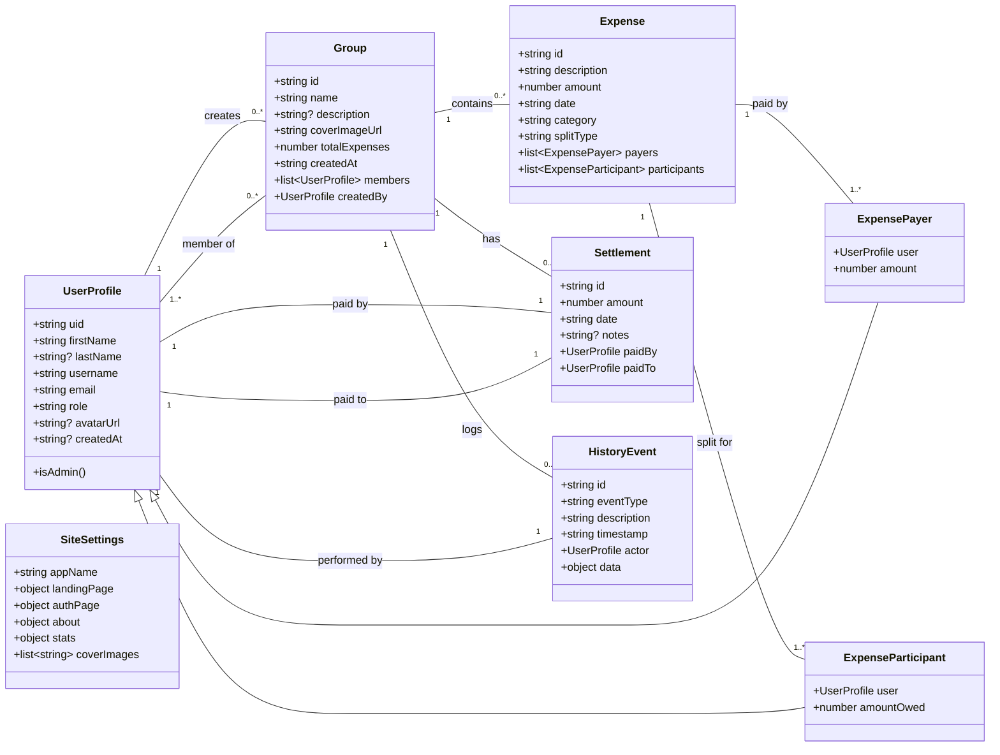

# {AppName} UML Class Diagram

This diagram outlines the core data models and their relationships within the {AppName} application.

### Relationships Explained:

*   **UserProfile & Group**:
    *   One `UserProfile` can create many `Group`s.
    *   Many `UserProfile`s can be members of many `Group`s.

*   **Group, Expense, Settlement, History**:
    *   One `Group` can contain multiple `Expense`s, `Settlement`s, and `HistoryEvent`s.

*   **Expense & UserProfile**:
    *   An `Expense` is paid by one or more `UserProfile`s (via the `ExpensePayer` link).
    *   An `Expense` is split among one or more `UserProfile`s (via the `ExpenseParticipant` link).

*   **Settlement & UserProfile**:
    *   A `Settlement` is a direct transaction from one `UserProfile` (`paidBy`) to another (`paidTo`).

*   **HistoryEvent & UserProfile**:
    *   Each `HistoryEvent` is triggered by a single `UserProfile` (the `actor`).

*   **SiteSettings**:
    *   This is a global configuration object, not directly linked to other models in this diagram, but it governs application-wide behavior and content.
